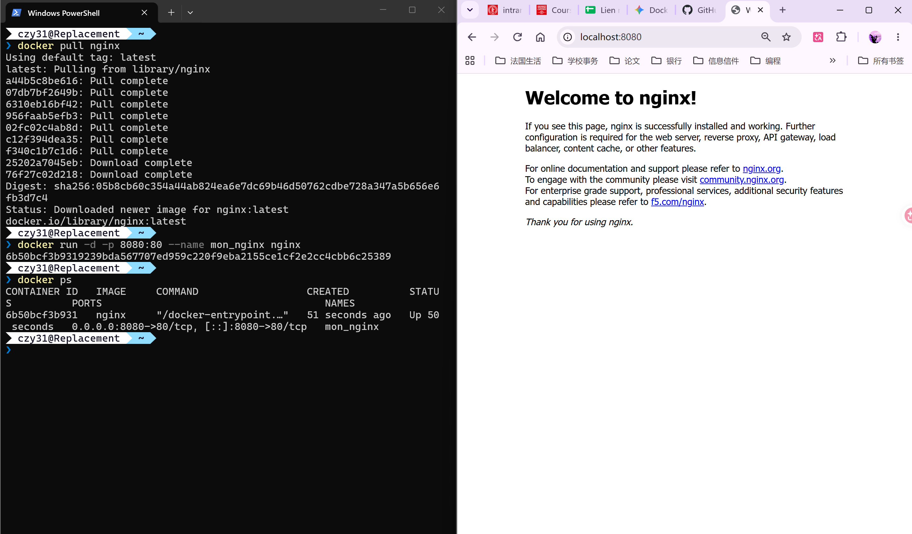
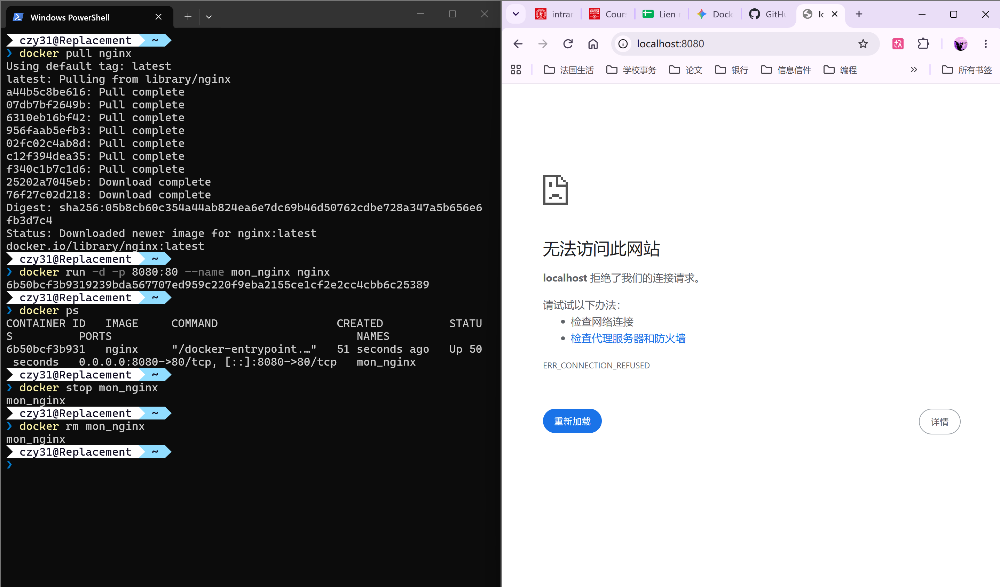

# Learn CI/CD - TP Docker

## Exercice 3: Manipulation de base des conteneurs

### 1. Commandes exécutées
- `docker --version` : Vérification de la version de Docker
- `docker images` : Liste des images locales
- `docker pull hello-world` : Téléchargement de l'image de test
- `docker run hello-world` : Exécution du conteneur de test
- `docker ps` & `docker ps -a` : Affichage des conteneurs actifs et terminés
- `docker rm <ID>` : Suppression du conteneur arrêté
- `docker rmi <ID>` : Suppression de l'image locale

### 2. Captures d'écran

## Exercice 4: Création d'un serveur web avec Docker

### 1. Commandes exécutées
- `docker pull nginx` : Téléchargement de l'image officielle Nginx
- `docker run -d -p 8080:80 --name mon_nginx nginx` : Lancement du serveur web en arrière-plan avec redirection de port
- `docker ps` : Vérification du bon fonctionnement du conteneur
- `docker stop mon_nginx` : Arrêt du serveur web
- `docker rm mon_nginx` : Suppression du conteneur

### 2. Captures d'écran
- Déploiement et accès web :  
  
- Arrêt, suppression et vérification de la coupure de service :  
  