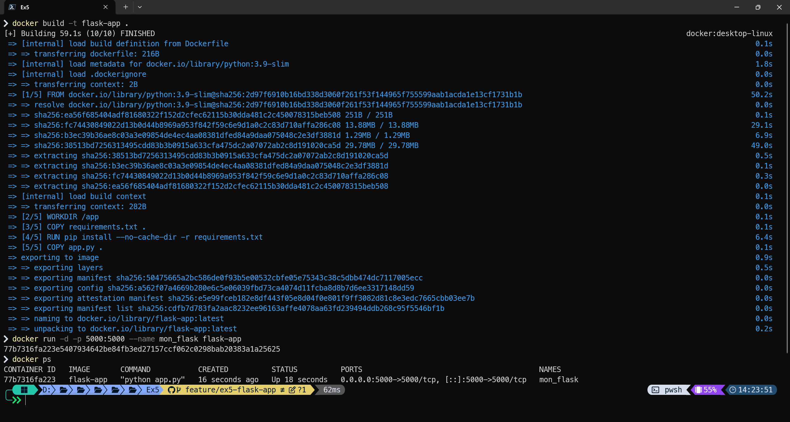
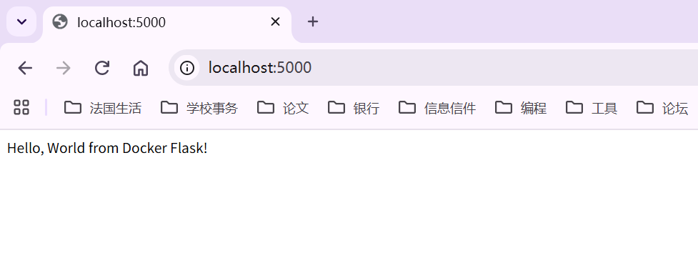
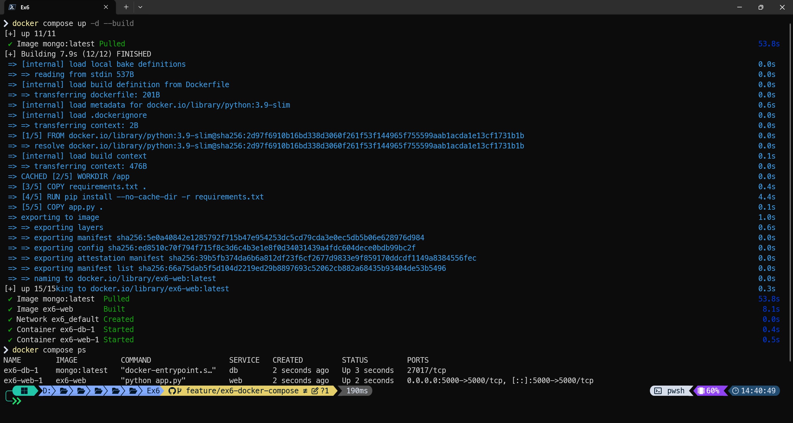
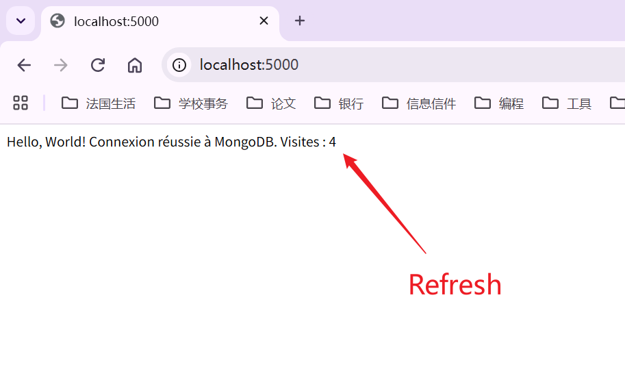
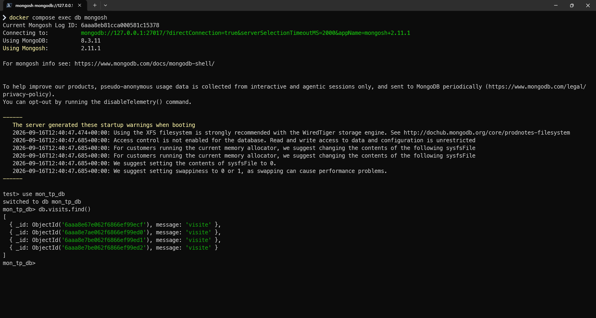

# Learn CI/CD - TP Docker

## Exercice 3: Manipulation de base des conteneurs

### 1. Commandes exécutées
- `docker --version` : Vérification de la version de Docker
- `docker images` : Liste des images locales
- `docker pull hello-world` : Téléchargement de l'image de test
- `docker run hello-world` : Exécution du conteneur de test
- `docker ps` & `docker ps -a` : Affichage des conteneurs actifs et terminés
- `docker rm <ID>` : Suppression du conteneur arrêté
- `docker rmi <ID>` : Suppression de l'image locale

### 2. Captures d'écran

## Exercice 4: Création d'un serveur web avec Docker

### 1. Commandes exécutées
- `docker pull nginx` : Téléchargement de l'image officielle Nginx
- `docker run -d -p 8080:80 --name mon_nginx nginx` : Lancement du serveur web en arrière-plan avec redirection de port
- `docker ps` : Vérification du bon fonctionnement du conteneur
- `docker stop mon_nginx` : Arrêt du serveur web
- `docker rm mon_nginx` : Suppression du conteneur

### 2. Captures d'écran
- Déploiement et accès web :  
  
- Arrêt, suppression et vérification de la coupure de service :  
  

## Exercice 5: Déploiement d'une application Python Flask

### 1. Description
Création d'une application minimale avec Flask, conteneurisée à l'aide d'un Dockerfile personnalisé et exécutée sur le port 5000.

### 2. Commandes exécutées
- `docker build -t flask-app .` : Construction de l'image Docker
- `docker run -d -p 5000:5000 --name mon_flask flask-app` : Lancement du conteneur
- `docker ps` : Vérification du statut du conteneur
- `docker stop mon_flask` : Arrêt du conteneur
- `docker rm mon_flask` : Suppression du conteneur

### 3. Captures d'écran
- Construction et exécution du conteneur :  
  
- Vérification dans le navigateur :  
  

## Exercice 6: Utilisation de docker compose

### 1. Description
Déploiement d'une architecture multi-conteneurs (Flask et MongoDB) orchestrée avec Docker Compose. L'application enregistre les visites dans la base de données et incrémente le compteur à chaque actualisation.

### 2. Commandes exécutées
- `docker compose up -d --build` : Construction et démarrage des conteneurs en arrière-plan
- `docker compose ps` : Vérification du statut des conteneurs
- `docker compose exec db mongosh` : Accès au shell interactif de MongoDB
- `docker compose down` : Arrêt et nettoyage des ressources

### 3. Captures d'écran
- Construction et démarrage des services :  
  
- Première visite (Visites : 1) :  
  
- Actualisation de la page (Visites : 4) :  
  
- Vérification des données insérées dans MongoDB :  
  