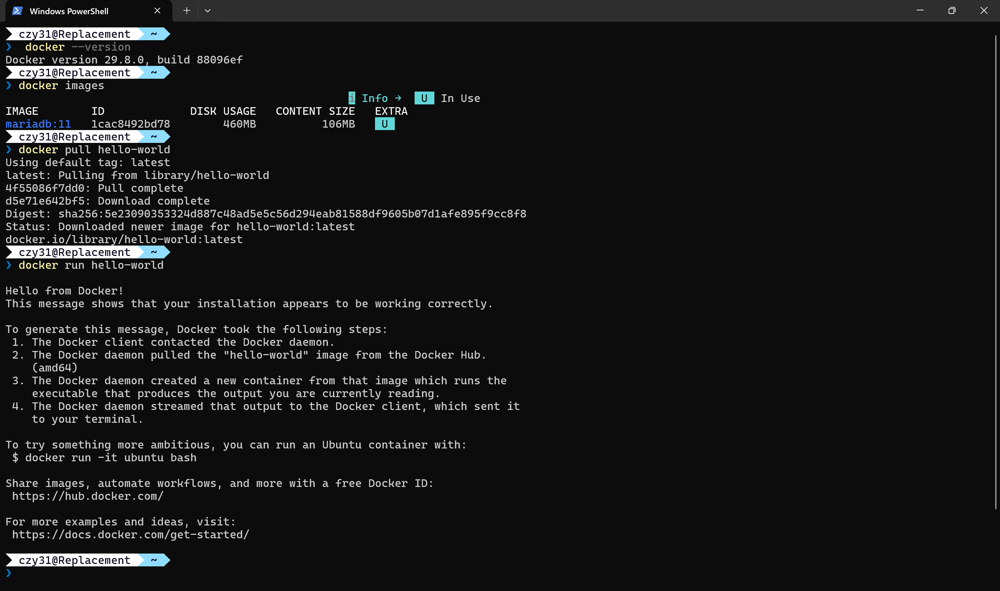
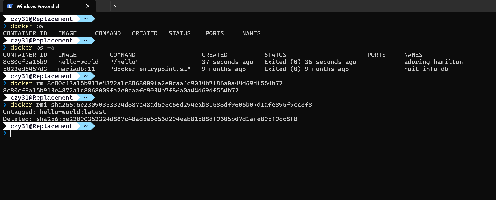

# Learn CI/CD - TP Docker

## Exercice 3: Manipulation de base des conteneurs

### 1. Commandes exécutées
- `docker --version` : Vérification de la version de Docker
- `docker images` : Liste des images locales
- `docker pull hello-world` : Téléchargement de l'image de test
- `docker run hello-world` : Exécution du conteneur de test
- `docker ps` & `docker ps -a` : Affichage des conteneurs actifs et terminés
- `docker rm <ID>` : Suppression du conteneur arrêté
- `docker rmi <ID>` : Suppression de l'image locale

### 2. Captures d'écran

